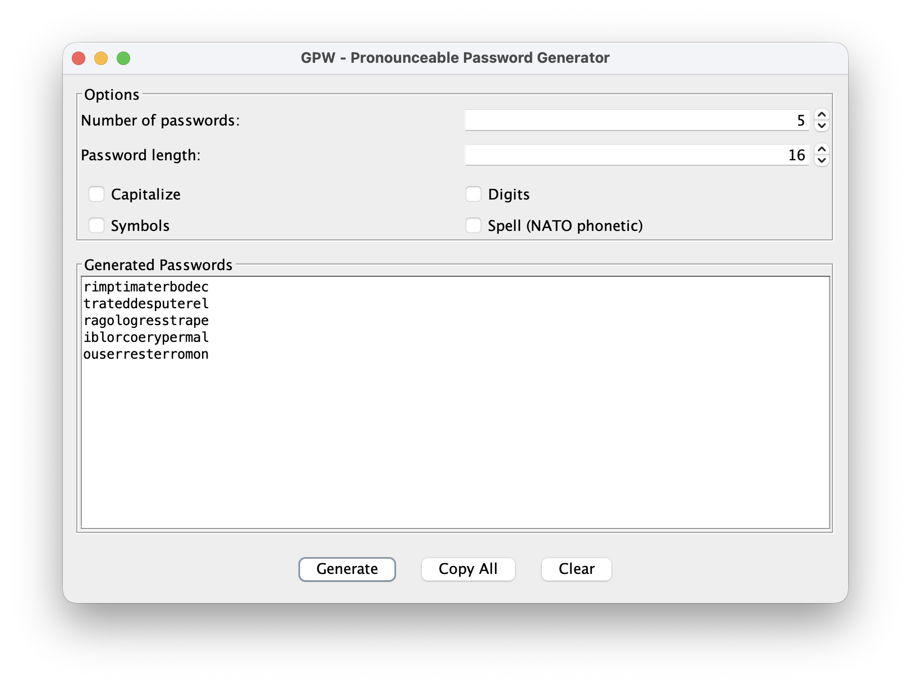
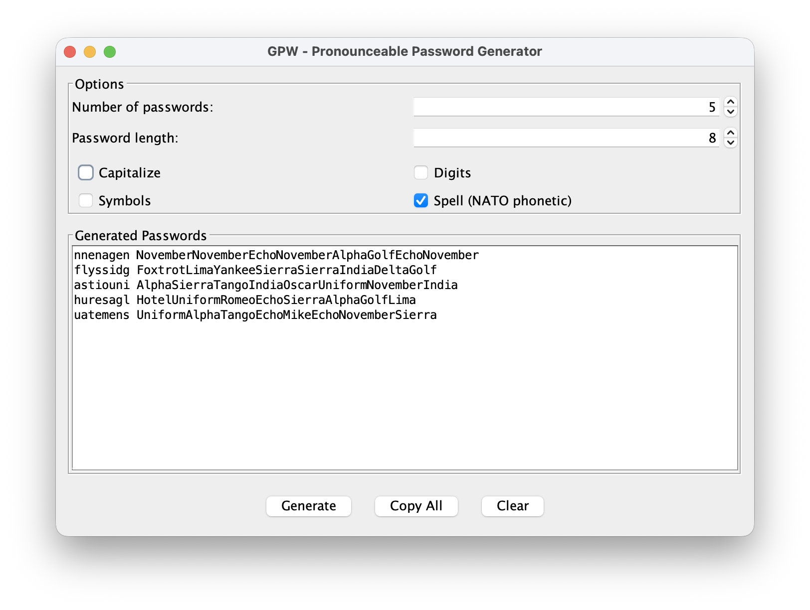
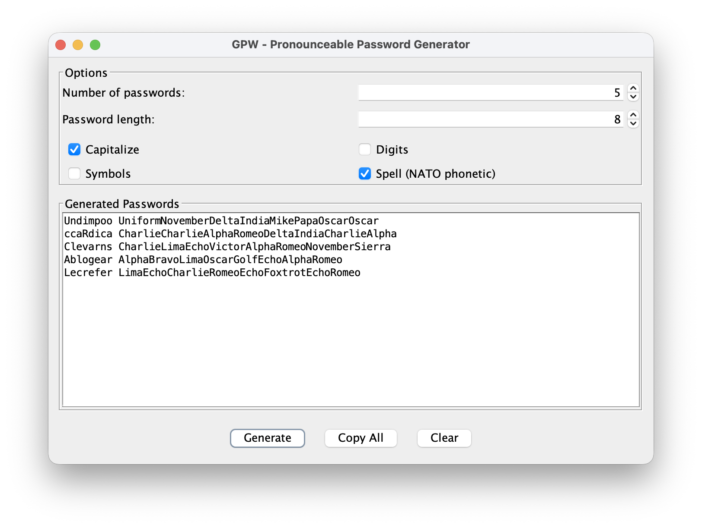
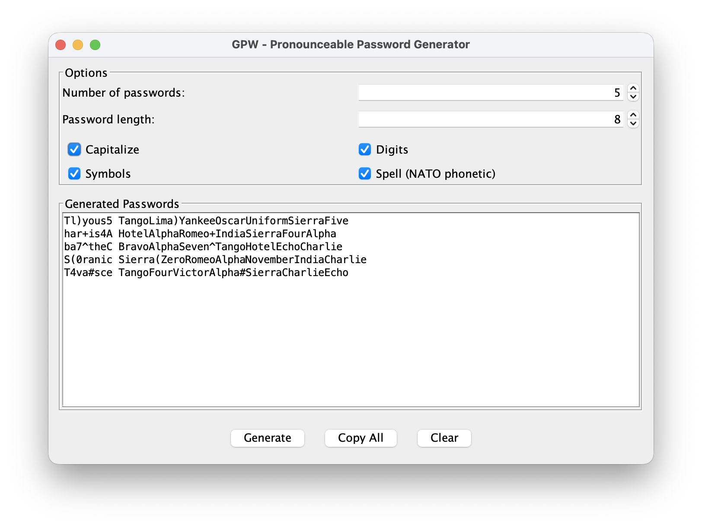

## Table Of Contents
- [Introduction](#introduction)
- [Changes](#changes)
- [How to build](#how-to-build)
- [How to use](#how-to-use)
  - [Maven projects](#maven-projects)
  - [Install locally (optional)](#install-locally-optional)
- [Examples](#examples)
- [Tools](#tools)
- [License](#license)

# Introduction

`libgpw` is java library to generate "pronounceable" passwords. The code is 
taken from the java implementation mentioned in [Random Password Generator](https://www.multicians.org/thvv/gpw.html) page.
The original source for the java applet is [Gpw.java](https://www.multicians.org/thvv/Gpw.java).
The code is extracted from the source and created this maven project.

The original author of the code describes gpw in the comment at the top of 
[Gpw.java](https://www.multicians.org/thvv/Gpw.java) as follows:
```bash
    /* GPW - Generate pronounceable passwords
     This program uses statistics on the frequency of three-letter sequences
     in English to generate passwords.  The statistics are
     generated from your dictionary by the program loadtris.

    See www.multicians.org/thvv/gpw.html for history and info.
    Tom Van Vleck

    THVV 06/01/94 Coded
    THVV 04/14/96 converted to Java
    THVV 07/30/97 fixed for Netscape 4.0
    */
```
# Changes

The following changes and additions are made to the original java code:

- Converted to a maven project from java applet code
- Created unit tests
- Uses `SecureRandom()` instead of `Random()`
- A CLI and a GUI using the library
- The following APIs are added

| API | Description |
|-----|-------------|
| `generatePasswords(int numberOfPasswords, int passwordLength)` | Generates a list of random passwords. Takes the number of passwords to generate and the desired length of each password. Returns a list of pronounceable passwords that are easier to remember than completely random character strings. |
| `generatePassphrases(int numberOfPassphrases, int numberOfWords, int wordLength)` | Generates a list of random passphrases. Takes the number of passphrases to generate, the number of words per passphrase, and the desired length of each word. Returns a list of multi-word passphrases that are more secure and memorable than single passwords. |
| `modifyPassword(String password, boolean capitalize, boolean numerals, boolean symbols)` | Modifies an existing password by adding complexity. Takes a password string and boolean flags to optionally add capitalization, numerals (0-9), and/or symbols (special characters). Returns the modified password with the requested enhancements to increase strength and meet password policy requirements. This is a static utility method. |

These APIs provide the core functionality for both the CLI tool and Swing GUI, allowing users to generate secure, pronounceable passwords and passphrases with customizable parameters.

# How to build

Requires jdk 11+

```
    mvn clean install
    mvn clean package
    mvn test
```

The jar file `libgpw-1.0.3.jar` will be created in `./target` directory

# How to use

## Maven projects

The library is available on Maven Central. Add the following dependency to your project's `pom.xml`:

```xml
<dependency>
    <groupId>com.muquit.libgpw</groupId>
    <artifactId>libgpw</artifactId>
    <version>1.0.3</version>
</dependency>
```

## Install locally (optional)

If you want to build from source and install to your local maven repository:

```bash
mvn install:install-file \
   -Dfile=./target/libgpw-1.0.3.jar \
   -DgroupId=com.muquit.libgpw \
   -DartifactId=libgpw \
   -Dversion=1.0.3 \
   -Dpackaging=jar \
   -DgeneratePom=true
```

This is useful if you want to modify the code and test it locally.

For non-maven projects, the `libgpw-1.0.3.jar` jar file is available from the 
[Releases](https://github.com/muquit/gpw/releases) page.

# Examples

Please look at 
[TestGpw.java](src/test/java/test/com/muquit/gpw/TestGpw.java) unit test file for complete examples.

```
    import com.muquit.libgpw;

    Gpw gpw = new Gpw();

    int npw = 4;
    int pwlen = 8;
    List<String> passwords = gpw.generatePasswords(npw, pwlen);
    for (String password: passwords)
    {
        logger.info(password);
        String modified = GpwPasswordModifier.modifyPassword(password, true, true, true);
        logger.info(" modified all: " + modified);

        modified = GpwPasswordModifier.modifyPassword(password, true, false, false);
        logger.info(" modified caps: " + modified);
    }
```

Add at lease one upper case letter. The number depends on the length of the password.

```
    final String original = "password";

    boolean capitalize = true;
    boolean numerals = false;
    boolean symbols = false;

    String modified = GpwPasswordModifier.modifyPassword(original, true, false, false);
    logger.info("Original: " + original + " Modified caps: " + modified);
```

Similarly numbers, symbols can be added to the password.

# Tools

The jar file can be used to run couple of tools. Note java 11+ is required.
Example:

*CLI*

```bash
➤ java -jar libgpw-1.0.3.jar  -h
Usage: gpw-cli [-cdhsVy] [-l=<passwordLength>] [-n=<numberOfPasswords>]
Generate pronounceable passwords
  -c, --capitalize   Add uppercase letters
  -d, --digits       Add numerals
  -h, --help         Show this help message and exit.
  -l, --length=<passwordLength>
                     Password length (default: 8)
  -n, --number=<numberOfPasswords>
                     Number of passwords to generate (default: 5)
  -s, --spell        Spell out password using NATO phonetic alphabet
  -V, --version      Print version information and exit.
  -y, --symbols      Add symbols
```

* Generate 5 password with length 16, all lowercase

```bash
➤ java -jar libgpw-1.0.3.jar  -n 5 -l 16
romanylindicaran
llimportfuserosh
pononverslosetch
ldepationferentr
ortivenavidenise
```

* Spell out passwords using NATO phonetic alphabet

```bash
./gpw.bash -n 5 -s
termosti TangoEchoRomeoMikeOscarSierraTangoIndia
nesteedi NovemberEchoSierraTangoEchoEchoDeltaIndia
ableston AlphaBravoLimaEchoSierraTangoOscarNovember
ucruderp UniformCharlieRomeoUniformDeltaEchoRomeoPapa
osoleman OscarSierraOscarLimaEchoMikeAlphaNovember
```

There are 2 helper scripts `gpw.bash` and `gwt.bat` are supplied for
convenience.

*GUI*

```
java -cp libgpw-1.0.3.jar gpwgui.GpwGui
```
Or use the helper scripts `gpw-gui.bash` and `gpw-gui.bat`

Some screenshots are shown below:









# License

```bash
MIT License

Copyright (c) 2026 https://muquit.com/

Permission is hereby granted, free of charge, to any person obtaining a copy
of this software and associated documentation files (the "Software"), to deal
in the Software without restriction, including without limitation the rights
to use, copy, modify, merge, publish, distribute, sublicense, and/or sell
copies of the Software, and to permit persons to whom the Software is
furnished to do so, subject to the following conditions:

The above copyright notice and this permission notice shall be included in all
copies or substantial portions of the Software.

THE SOFTWARE IS PROVIDED "AS IS", WITHOUT WARRANTY OF ANY KIND, EXPRESS OR
IMPLIED, INCLUDING BUT NOT LIMITED TO THE WARRANTIES OF MERCHANTABILITY,
FITNESS FOR A PARTICULAR PURPOSE AND NONINFRINGEMENT. IN NO EVENT SHALL THE
AUTHORS OR COPYRIGHT HOLDERS BE LIABLE FOR ANY CLAIM, DAMAGES OR OTHER
LIABILITY, WHETHER IN AN ACTION OF CONTRACT, TORT OR OTHERWISE, ARISING FROM,
OUT OF OR IN CONNECTION WITH THE SOFTWARE OR THE USE OR OTHER DEALINGS IN THE
SOFTWARE.
```

---

This project incorporates work covered by the following copyright and 
permission notice:

Random Password Generator by Tom Van Vleck

As requested by the original author: 
1. Users of this software are encouraged to share their source freely.
2. Please inform the original author if you are using this software.
3. Credit should be given to the original author and other pioneers for 
the data and algorithms used.

For full attribution and usage requirements, please see the [NOTICE.txt](NOTICE.txt)
file in this repository.


---
<sub>TOC is created by https://github.com/muquit/markdown-toc-go on May-27-2026</sub>
